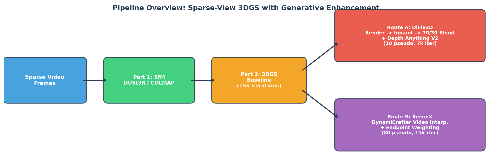
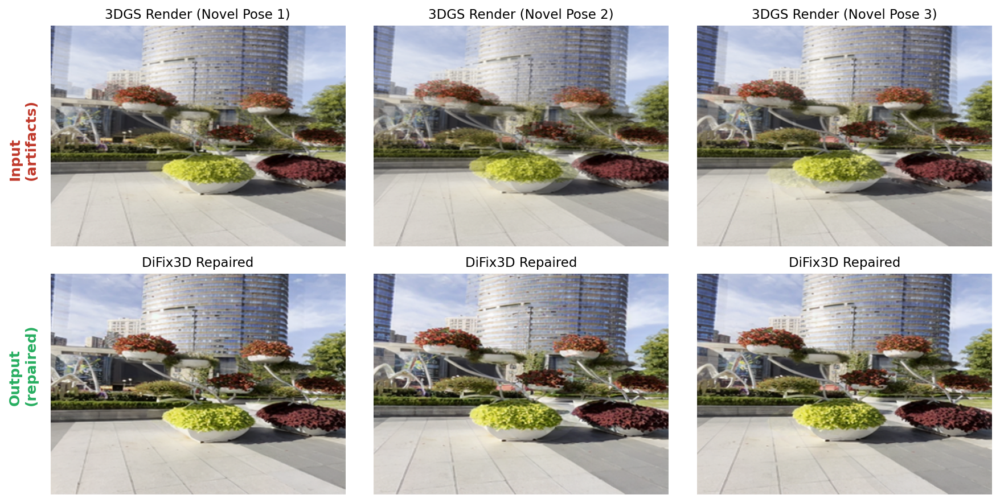
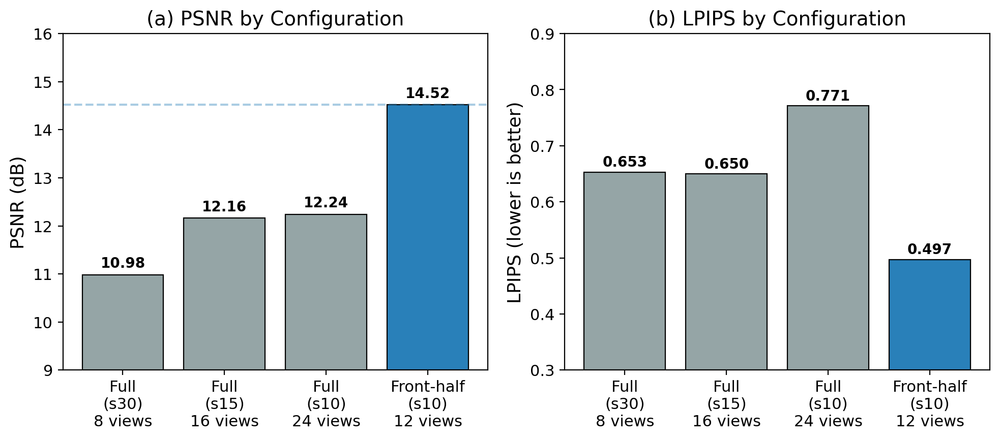
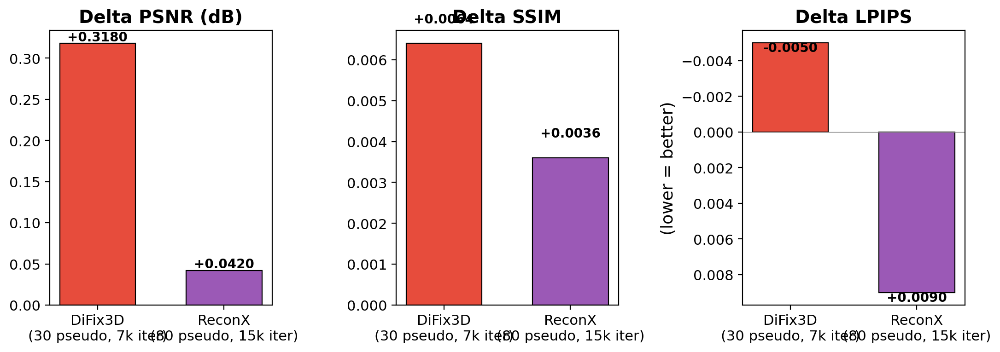
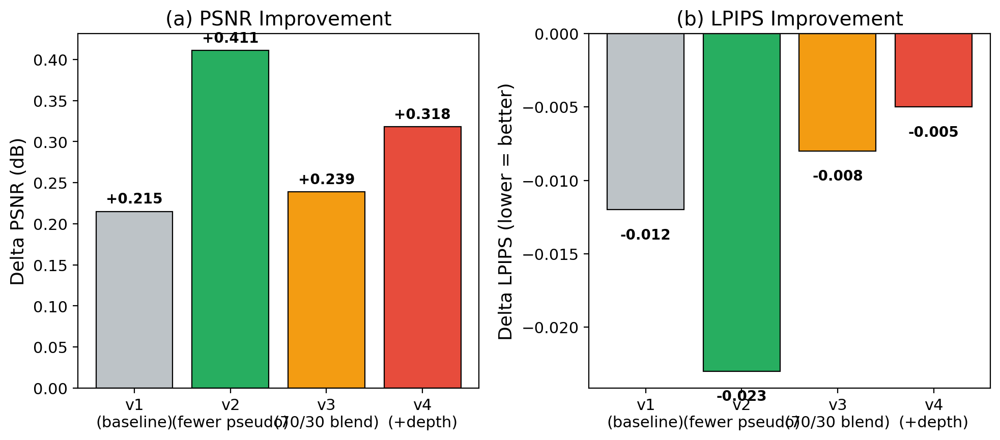

# Sparse-View 3DGS with Generative Pseudo-View Enhancement

AIAA3201 Final Project — Heyuan Chen (50026298), Xingbei Chen (50026573)

## Overview

A complete pipeline for sparse-view 3D reconstruction using 3D Gaussian Splatting, enhanced by generative models that synthesize pseudo-views for improved reconstruction quality.



### Key Results

| Route | Pseudo-Views | Delta PSNR | Delta LPIPS | Time |
|-------|-------------|-----------|------------|------|
| **DiFix3D v4** | 30 | **+0.318 dB** | **-0.005** | 189s |
| ReconX v2 | 80 | +0.042 dB | +0.009 | 266s |

DiFix3D achieves 7.6x higher PSNR improvement with 63% fewer pseudo-views.

## Project Structure

```
├── src/
│   ├── common/          # Camera, dataset, metrics utilities
│   ├── gaussian_splatting/  # 3DGS model, renderer, trainer
│   ├── part1/           # COLMAP vs DUSt3R comparison
│   ├── part2/           # Unposed sparse reconstruction
│   ├── part3/           # Pseudo-view generation & confidence
│   └── difix3d/         # DiFix3D inpainting model
├── scripts/
│   ├── run_part1.py     # Part 1: SfM comparison
│   ├── run_part2.py     # Part 2: Baseline 3DGS
│   ├── run_part3_difix3d_v4.py  # Part 3 Route A (final)
│   ├── run_part3_reconx.py      # Part 3 Route B
│   ├── render_demo_video.py     # Demo video generation
│   └── visualize_comparison.py  # Visualization tools
├── configs/             # Dataset and training configs
├── results/             # Quantitative results (JSON)
├── figures/             # Report figures
└── requirements.txt
```

## Installation

```bash
# Clone repository
git clone https://github.com/[username]/sparse-view-3dgs.git
cd sparse-view-3dgs

# Create environment
conda create -n sv3dgs python=3.10
conda activate sv3dgs

# Install PyTorch (CUDA 11.8)
pip install torch torchvision --index-url https://download.pytorch.org/whl/cu118

# Install dependencies
pip install -r requirements.txt

# Install DUSt3R (for Part 1 & 2)
git clone https://github.com/naver/dust3r.git
pip install -e dust3r/
```

## Datasets

Download and place in `data/`:
- **DL3DV-2**: [DL3DV Benchmark](https://dl3dv-10k.github.io/)
- **RE10K-1**: [RealEstate10K](https://google.github.io/realestate10k/)
- **Waymo-405841**: [Waymo Open Dataset](https://waymo.com/open/)

```
data/
├── dl3dv-2/
├── re10k-1/
└── waymo-405841/
```

## Usage

### Part 1: SfM Comparison (COLMAP vs DUSt3R)

```bash
python scripts/run_part1.py --dataset dl3dv --data_path data/dl3dv-2
python scripts/run_part1.py --dataset re10k --data_path data/re10k-1
```

### Part 2: Unposed Sparse 3DGS Reconstruction

```bash
python scripts/run_part2.py --dataset dl3dv --data_path data/dl3dv-2 \
    --sparsity 10 --front_half --output_path outputs/part2/dl3dv_s10_front_half
```

### Part 3 Route A: DiFix3D Enhancement (Recommended)

```bash
python scripts/run_part3_difix3d_v4.py \
    --dataset dl3dv \
    --data_path data/dl3dv-2 \
    --part2_path outputs/part2/dl3dv_s10_front_half \
    --output_path outputs/part3_difix3d/dl3dv_v4
```

### Part 3 Route B: ReconX (DynamiCrafter)

```bash
python scripts/run_part3_reconx.py \
    --dataset dl3dv \
    --data_path data/dl3dv-2 \
    --part2_path outputs/part2/dl3dv_s10_front_half \
    --output_path outputs/part3_reconx/dl3dv_v2
```

### Render Demo Video

```bash
python scripts/render_demo_video.py \
    --dataset dl3dv \
    --part3_path outputs/part3_difix3d/dl3dv_v4
```

## Pre-trained Weights

- **DUSt3R**: Auto-downloaded on first run from [naver/dust3r](https://github.com/naver/dust3r)
- **DiFix3D**: Place weights in `weights/difix3d/` (see [DiFix3D repo](https://github.com/))
- **Depth Anything V2**: Auto-downloaded via HuggingFace `transformers`
- **DynamiCrafter**: Pre-generated outputs in `dc_output/` (see ReconX pipeline)

## Results

### Part 1: SfM Comparison

| Dataset | COLMAP PSNR | DUSt3R PSNR | DUSt3R Speedup |
|---------|------------|------------|----------------|
| DL3DV | 8.29 | **10.39** | 22x |
| RE10K | **10.79** | 9.96 | -- |

### Part 2: Sparsity Study (DL3DV)

| Configuration | Views | PSNR | LPIPS | ATE RMSE |
|---------------|-------|------|-------|----------|
| full (s30) | 8 | 10.98 | 0.653 | 0.592 |
| full (s10) | 24 | 12.24 | 0.771 | 0.724 |
| **front-half (s10)** | **12** | **14.52** | **0.497** | **0.363** |

### Part 3: Generative Enhancement

| Route | Pseudo | Iter | Delta PSNR | Delta LPIPS |
|-------|--------|------|-----------|------------|
| **DiFix3D v4** | 30 | 7k | **+0.318** | **-0.005** |
| ReconX v2 | 80 | 15k | +0.042 | +0.009 |

### Cross-Dataset

| Dataset | Baseline | Delta PSNR |
|---------|----------|-----------|
| DL3DV (s10) | 14.52 | +0.32 |
| RE10K (s30) | 11.70 | +2.10 |
| Waymo (s10) | 12.85 | +2.23 |

## Visual Results

### DiFix3D Inpainting Effect


### Sparsity Comparison


### Two-Route Comparison


### Ablation Study


## Demo Videos

- `results/part3_difix3d/demo_dl3dv.mp4` — DiFix3D enhanced rendering
- `results/part3_reconx/demo_dl3dv.mp4` — ReconX enhanced rendering

## Hardware Requirements

- GPU: 16 GB VRAM minimum (tested on RTX 4080)
- RAM: 32 GB recommended
- Storage: ~10 GB for datasets + outputs

## Acknowledgments

- [3D Gaussian Splatting](https://github.com/graphdeco-inria/gaussian-splatting)
- [DUSt3R](https://github.com/naver/dust3r)
- [Depth Anything V2](https://github.com/DepthAnything/Depth-Anything-V2)
- [DiFix3D](https://github.com/)
- [DynamiCrafter / ReconX](https://github.com/)
